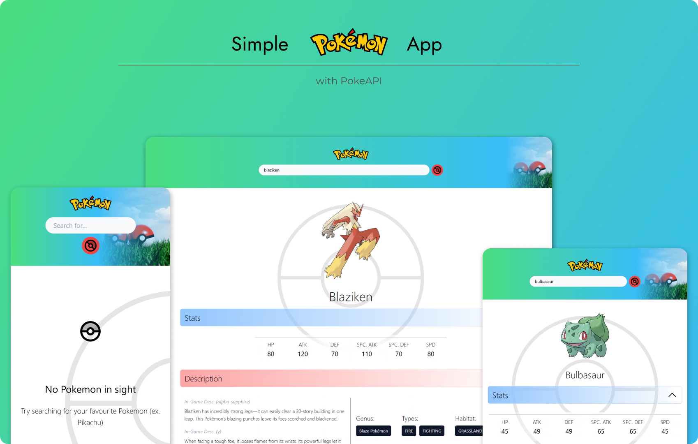

# Simple Pokemon App



### Greetings! 👋

This is a simple app where you can access Pokemon-related information through [PokeAPI](https://pokeapi.co/).

- Made with responsive design in mind, allowing for seamless viewing experience across various device
- Uses async image loading to improve initial load experience

### 🔗 [Live Demo](https://simplepokeapp.netlify.app/)

## ⚙️ Getting Started

To run the app on your local machine:

1. Clone this project repository

```bash
git clone https://github.com/DerianMelvin/simple-pokemon-app.git
```

2. Navigate to the project directory:

```bash
cd simple-pokemon-app
```

3. Install project dependencies with [NPM](https://www.npmjs.com/) or [PNPM](https://pnpm.io/):

```bash
npm install

# OR

pnpm install
```

4. Start the development server:

```bash
pnpm dev
```

The application will launch and can be viewed in your web browser at [http://localhost:5173](http://localhost:5173).

## 🛠️ Tools & Tech

[](https://skillicons.dev)